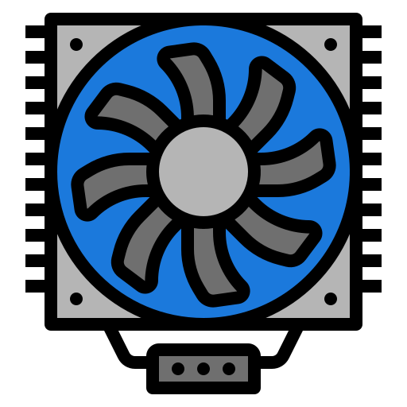

# Pwm Fan controller via ESPHome using Esp01 or Esp32



---

## **Table of Contents**

1. [Project Overview](#project-overview)
2. [Features](#features)
3. [System Requirements](#system-requirements)
4. [Installation](#installation)
5. [Configuration](#configuration)
6. [Usage](#usage)
7. [User Interface](#user-interface)
8. [Assets and Resources](#assets-and-resources)
9. [Troubleshooting](#troubleshooting)
10. [FAQ](#faq)
11. [Contributing](#contributing)
12. [License](#license)
13. [Acknowledgements](#acknowledgements)

---

## **Project Overview**

The **Fan automation** is a lightweight, intuitive desktop application designed to provide precise control over fan speed using **PWM (Pulse Width Modulation)** technology. Built with Python and PyQt5, it allows users to:

* Adjust fan speed dynamically.
* Monitor real-time performance.
* Save and load custom profiles.
* Utilize plugins for enhanced functionality.

This project is ideal for electronics enthusiasts, DIY PC builders, and anyone looking to optimize cooling systems programmatically.

---

## **Features**

* ✅ Dynamic fan speed adjustment via GUI sliders
* ✅ Profile saving and loading
* ✅ Custom icons and logos for personalization
* ✅ Cross-platform compatibility (Windows, Linux, MacOS)
* ✅ Minimal dependencies for easy installation
* ✅ Plugin support for advanced features

---

## **System Requirements**

* Python 3.11 or higher
* PyQt5 library
* Operating System: Windows 10/11, Linux, or MacOS
* At least 50MB of free disk space
* Optional: Fan hardware capable of PWM control

---

## **Installation**

### **1. Using Precompiled Executable**

1. Download the `.exe` from the [Releases](#) section.
2. Place it in any directory.
3. Double-click to launch the app.

### **2. From Source**

```bash
# Clone the repository
git clone https://github.com/<your-username>/fan-control-app.git

# Navigate into the project folder
cd fan-control-app

# Install dependencies
pip install -r requirements.txt

# Run the app
python fan_control_app.py
```

---

## **Configuration**

* The app comes with a `config.json` file for advanced users.
* Example configuration parameters:

```json
{
  "default_speed": 50,
  "max_speed": 100,
  "min_speed": 0,
  "profile_save_path": "./profiles"
}
```

* Change values according to your hardware and preference.

---

## **Usage**

1. Open the app.
2. Use the **slider** to adjust fan speed.
3. Click **Save Profile** to save your settings.
4. Load profiles as needed via **Load Profile**.
5. Use the **Advanced Settings** tab for plugin features.

---

## **User Interface**

* **Main Window**: Controls the fan speed slider.
* **Profiles Tab**: Save/load multiple configurations.
* **Advanced Tab**: Access plugins and additional settings.
* **Status Bar**: Shows current fan speed and system status.

**Screenshot Example:**


---

## **Assets and Resources**

The project includes:

* `logo.png` – App logo
* `app_icon.ico` – Application icon
* `bin/` – Precompiled binaries for internal use
* `plugins/` – Optional plugins to enhance features
* `docs/` – Documentation and diagrams

---

## **Troubleshooting**

* **App won’t start:** Ensure Python 3.11+ and PyQt5 are installed.
* **Fan not responding:** Check PWM connections and power supply.
* **Error with plugin loading:** Make sure plugin files are in the `plugins/` folder.
* **Executable issues:** Delete old `.spec` files and rebuild using PyInstaller.

---

## **FAQ**

**Q: Can I use this on Linux?**
A: Yes, the app is cross-platform. Just make sure dependencies are installed.

**Q: Can I control multiple fans?**
A: Currently, the app supports one fan per instance. Multiple fans require separate instances or plugins.

**Q: Is this safe for my hardware?**
A: Yes, as long as you stay within recommended fan voltage and PWM limits.

---

## **Contributing**

We welcome contributions!

1. Fork the repository.
2. Create a new branch (`git checkout -b feature-name`).
3. Make your changes.
4. Commit (`git commit -am 'Add feature'`).
5. Push (`git push origin feature-name`).
6. Open a Pull Request.

**Please follow:**

* Code formatting with PEP8
* Comment your code
* Include screenshots if you change the UI

---

## **License**

This project is licensed under the **MIT License**. See the [LICENSE](LICENSE) file for details.

---

## **Acknowledgements**

* PyQt5 Library
* Python Community
* Hardware enthusiasts who inspired this project
* Icon and asset designers

